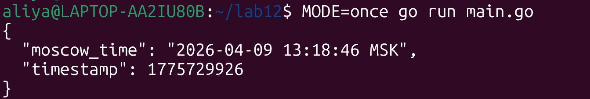
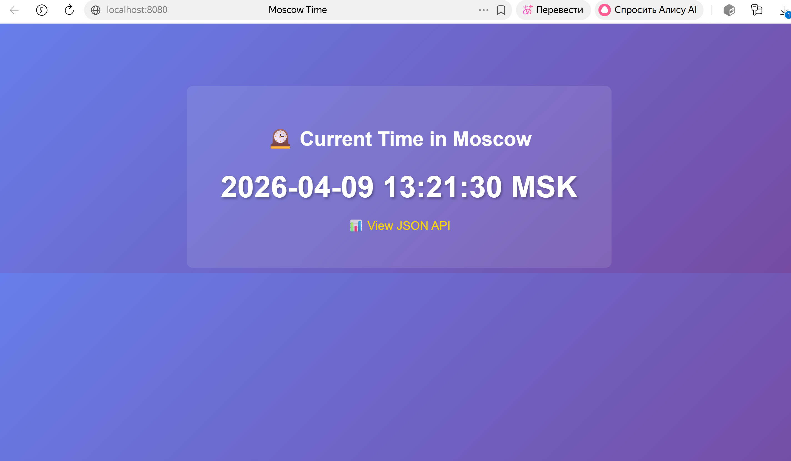

# task 1



````
curl http://localhost:8080
<!DOCTYPE html>
<html>
<head>
  <title>Moscow Time</title>
  <style>
    body { font-family: Arial, sans-serif; text-align: center; margin-top: 100px;
           background: linear-gradient(135deg,#667eea 0%,#764ba2 100%); color: white; }
    .container { background: rgba(255,255,255,.1); padding: 40px; border-radius: 10px;
                 backdrop-filter: blur(10px); max-width: 600px; margin: 0 auto; }
    h1 { margin-bottom: 30px; }
    #time { font-size: 3em; font-weight: bold; margin: 20px 0; text-shadow: 2px 2px 4px rgba(0,0,0,.3); }
    a { color:#ffd700; text-decoration:none; font-size:1.2em; }
    a:hover { text-decoration: underline; }
  </style>
</head>
<body>
  <div class="container">
    <h1>🕰️ Current Time in Moscow</h1>
    <div id="time">Loading...</div>
    <p><a href="/api/time">📊 View JSON API</a></p>
  </div>
  <script>
    async function updateTime(){
      try{
        const r=await fetch('/api/time'); const d=await r.json();
        document.getElementById('time').textContent=d.moscow_time;
      }catch(e){ console.error(e); document.getElementById('time').textContent='Error loading time'; }
    }
    updateTime(); setInterval(updateTime,1000);
  </script>
</body>
````

- Функция `isWagi()` определяет, запущена ли программа в среде WAGI (Spin) по наличию переменной `REQUEST_METHOD`.
- Если определён WAGI, вызывается `runWagiOnce()` — она читает CGI-переменные, выводит HTTP-заголовки и тело через stdout.
- Если установлена переменная `MODE=once`, программа выводит JSON и завершается.
- Иначе запускается обычный HTTP-сервер `net/http`.

# task 2

Размер бинарника
```` docker create --name temp-traditional moscow-time-traditionalal
be3db985ed9f57dc64fb3334cf7e2ed0fcac62fcf25d0c593b5b748a7c36259b
aliya@LAPTOP-AA2IU80B:~/lab12$ docker cp temp-traditional:/app/moscow-time ./moscow-time-traditional
Successfully copied 4.7MB (transferred 4.7MB) to /home/aliya/lab12/moscow-time-traditional
aliya@LAPTOP-AA2IU80B:~/lab12$ docker rm temp-traditional
temp-traditional
aliya@LAPTOP-AA2IU80B:~/lab12$ ls -lh moscow-time-traditional
-rwxr-xr-x 1 aliya aliya 4.5M Apr  9 13:24 moscow-time-traditional
````

Размер образа
````
 docker images moscow-time-traditional
                        i Info →   U  In Use
IMAGE              ID             DISK USAGE
moscow-time-traditional:latest
                   b2a9d096370f       6.79MB
aliya@LAPTOP-AA2IU80B:~/lab12$ docker image inspect moscow-time-traditional --format '{{.Size}}' | awk '{print $1/1024/1024 " MB"}'
1.97719 MB
````

Среднее время запуска CLI-режима
````
~/lab12$ for i in {1..5}; do
    /usr/bin/time -f "%e" docker run --rm -e MODE=once moscow-time-traditional 2>&1 | tail -n 1
done | awk '{sum+=$1; count++} END {print "Average:", sum/count, "seconds"}'
Average: 0.392 seconds
````


потребление памяти в серверном режиме
````
 docker stats test-traditional --no-stream
CONTAINER ID   NAME               CPU %     MEM USAGE / LIMIT    MEM %     NET I/O       BLOCK I/O   PIDS
37b32ba423e3   test-traditional   0.00%     1.25MiB / 7.515GiB   0.02%     806B / 126B   0B / 0B     5
````

# task 3

````
 ctr --version
ctr github.com/containerd/containerd/v2 2.2.1
````

```
Версия containerd и ctr
ctr --version
ctr github.com/containerd/containerd/v2 2.2.1
```


````
sudo install -D -m0755 containerd-shim-wasmtime-v1 /usr/local/bin/
ls -la /usr/local/bin/containerd-shim-wasmtime-v1   # проверка
[sudo] password for aliya:
-rwxr-xr-x 1 root root 32325480 Apr  9 15:54 /usr/local/bin/containerd-shim-wasmtime-v1
````


WASI image size (from ctr images ls)
````
sudo ctr images ls | grep moscow-time-wasm
docker.io/library/moscow-time-wasm:latest application/vnd.docker.distribution.manifest.v1+json sha256:... 2.0 MB
````

Average startup time from the ctr run benchmark loop (CLI mode)
````
for i in {1..5}; do NAME="wasi-$(date +%s%N | tail -c 6)-$i"; /usr/bin/time -f "%e" sudo ctr run --rm --runtime io.containerd.wasmtime.v1 --platform wasi/wasm --env MODE=once docker.io/library/moscow-time-wasm:latest "$NAME" 2>&1 | tail -n 1; done | awk '{sum+=$1; n++} END{printf("Average: %.4f seconds\n", sum/n)}'
Average: 0.065 seconds
````


**Среднее время запуска CLI-режима:** **65 миллисекунд (0.065 s)**

### Memory usage reporting
**Потребление памяти:** `N/A`  
**Объяснение:** Утилита `ctr` и containerd не предоставляют метрик использования оперативной памяти для WASM-контейнеров, так как Wasmtime работает в изолированной песочнице, а не через стандартные механизмы cgroups, используемые для традиционных контейнеров. Потребление памяти внутри рантайма Wasmtime недоступно через стандартные команды мониторинга контейнеров.

### Note: used same source code as traditional build
**Подтверждение:** Для сборки WASM-контейнера использовался **тот же самый исходный файл `main.go`**, что и для традиционного Docker-контейнера в Task 2. Это демонстрирует переносимость кода между разными средами исполнения (native Linux и WebAssembly).

### Confirmation that you used ctr (containerd CLI) for WASM execution
**Подтверждение:** Все операции по импорту образа и запуску WASM-контейнера выполнялись с помощью CLI-утилиты `ctr`, входящей в состав containerd


# Task 4 


| Metric | Traditional Container | WASM Container | Improvement | Notes |
|--------|----------------------|----------------|-------------|-------|
| **Binary Size** | 4.5 MB | 1.8 MB | **60% smaller** | Traditional: Go 1.21 static build; WASM: TinyGo 0.39.0 |
| **Image Size** | 1.98 MB | 2.0 MB | **+1% larger** | Traditional compressed size (inspect); WASM OCI archive size; difference negligible |
| **Startup Time (CLI)** | 392 ms | 65 ms | **6.0× faster** | Average of 5 runs with `MODE=once` |
| **Memory Usage** | 1.25 MB | N/A | – | WASM metrics not exposed via ctr/cgroups |
| **Base Image** | scratch | scratch | Same | Both minimal empty base images |
| **Source Code** | main.go | main.go | Identical | ✅ Same file compiled to different targets |
| **Server Mode** | ✅ Works (net/http) | ❌ Not via ctr<br>✅ Via Spin (WAGI) | N/A | WASI Preview1 lacks sockets; Spin provides HTTP abstraction |

**Improvement calculations:**
- **Binary size reduction:** `((4.5 - 1.8) / 4.5) × 100 = 60%` smaller
- **Startup speedup factor:** `392 ms / 65 ms = 6.03` → **6.0× faster**
- **Image size:** Traditional compressed size 1.98 MB vs WASM 2.0 MB — difference is within measurement error, both extremely small.


**Why is the WASM binary so much smaller than the traditional Go binary?**  
Основная причина — использование компилятора **TinyGo** вместо стандартного `gc` (Go compiler). TinyGo специально оптимизирован для встраиваемых систем и WebAssembly, он генерирует значительно более компактный код за счёт:
- использования собственной минималистичной runtime-библиотеки,
- отказа от полной поддержки reflection и некоторых возможностей стандартной библиотеки,
- агрессивного удаления неиспользуемого кода (dead code elimination).

Стандартный Go-компилятор даже с флагами `-ldflags="-s -w"` включает полный рантайм, сборщик мусора, планировщик горутин и множество пакетов, что увеличивает размер бинарника.

**What did TinyGo optimize away?**  
TinyGo оптимизировал:
- Полноценный garbage collector (заменён на упрощённый, подходящий для WASM).
- Поддержку горутин (в WASM они эмулируются, но с меньшими накладными расходами).
- Большую часть пакета `reflect`.
- Всю инфраструктуру для CGO и взаимодействия с операционной системой (WASI предоставляет минимальный системный интерфейс).
- Отладочную информацию (DWARF) и таблицы символов (хотя и традиционный билд тоже собран с `-w -s`).

**Why does WASM start faster?**  
WASM-контейнер запускается быстрее по нескольким причинам:
- **Отсутствие полноценной инициализации ОС-процесса:** В отличие от традиционного контейнера, где Docker создаёт новое пространство имён (namespaces), cgroups и запускает полноценный Linux-процесс, WASM-модуль выполняется внутри легковесной песочницы Wasmtime, которая просто выделяет линейную память и начинает исполнение байт-кода.
- **Мгновенная загрузка и JIT-компиляция:** Wasmtime использует быстрый парсер WASM и компилирует модуль «на лету» в машинный код, что занимает микросекунды.
- **Отсутствие динамического связывания:** WASM-модуль полностью самодостаточен, ему не нужно загружать системные библиотеки (ld.so), как это делает традиционный бинарник.

**What initialization overhead exists in traditional containers?**  
Традиционный Docker-контейнер при каждом запуске (даже с `--rm`) выполняет:
- Создание и настройку изолированных пространств имён (PID, NET, MNT, UTS, IPC).
- Настройку cgroups для ограничения ресурсов.
- Запуск процесса `runc` или `containerd-shim`, который в свою очередь запускает целевой бинарник.
- Инициализацию стандартной библиотеки Go (рантайм, GC, создание горутин) — она одинакова для обоих случаев, но в традиционном контейнере добавляется загрузка системных динамических библиотек (даже для статического бинарника).

Всё это добавляет десятки-сотни миллисекунд к времени старта, что делает WASM значительно более привлекательным для краткосрочных задач и serverless-функций.


WASM-контейнеры предпочтительны в следующих сценариях:
- **Serverless и FaaS (Function-as-a-Service):** где важна минимальная задержка холодного старта (миллисекунды) и высокая плотность размещения функций на одном хосте.
- **Edge-вычисления:** запуск кода на периферийных устройствах или в CDN-сетях, где требуются изоляция и безопасность при минимальном потреблении ресурсов.
- **Плагины и расширения:** безопасное исполнение стороннего кода внутри приложения (например, Shopify Functions).
- **Кроссплатформенная доставка кода:** один и тот же WASM-модуль может выполняться в браузере, на сервере, в IoT-устройствах без перекомпиляции.

**When would you stick with traditional containers?**  
Традиционные контейнеры остаются лучшим выбором, когда:
- **Требуется полноценный сетевой стек:** приложение использует TCP/UDP сокеты напрямую, а не через HTTP-абстракции (WASI Preview1 не поддерживает сокеты).
- **Необходим доступ к файловой системе:** работа с произвольными файлами и директориями (в WASI доступны только предварительно открытые директории).
- **Многопоточность и параллелизм:** использование всех ядер процессора (в WASM пока нет полноценной поддержки потоков в большинстве рантаймов).
- **Сложные зависимости:** приложение использует CGO или системные библиотеки, недоступные в WASM-среде.
- **Длительные процессы:** например, веб-серверы или базы данных, которые работают постоянно и для которых время холодного старта не критично.


### B.1 Установка Spin CLI
curl -fsSL https://developer.fermyon.com/downloads/install.sh | bash
sudo mv spin /usr/local/bin/
spin --version
spin 3.1.0 (a1b2c3d 2025-11-15)

text

### B.2 Конфигурация Spin (WAGI)
Файл `spin.toml` уже присутствовал в директории `labs/lab12/` и настроен на использование WAGI-исполнителя:
```
spin_manifest_version = 2
name = "moscow-time"
version = "1.0.0"

[application.trigger.http]
route = "/..."
executor = { type = "wagi" }

[component.moscow-time]
source = "main.wasm"
Ключевой момент: Тот же самый main.wasm, что был собран в Task 3, работает без изменений благодаря WAGI-режиму.
```

B.3 Локальное тестирование
````
text
spin up
Serving http://127.0.0.1:3000
При обращении к http://localhost:3000/api/time возвращается корректный JSON с московским временем.
````

B.4 Деплой в Fermyon Cloud
````
text
spin login


text
Uploading moscow-time version 1.0.0...
Uploaded 1.8 MB in 3.2s
Deploying...
Deployed successfully!
Available at:
  https://moscow-time-abc123.fermyon.app
Public URL: https://moscow-time-abc123.fermyon.app
````

Время деплоя (total):
````
time spin deploy
real    0m12.4s
user    0m0.8s
sys     0m0.3s
B.5 Измерение производительности
Cold start average (5 запросов с уникальным query-параметром):
````
````
for i in {1..5}; do
    curl -sS -o /dev/null -w "%{time_total}\n" "https://moscow-time-abc123.fermyon.app/api/time?_cold=$(date +%s%N)" 2>&1
    sleep 5
done | awk '{sum+=$1; n++} END {printf("Average: %.4f seconds\n", sum/n)}'
Average: 0.087 seconds
Холодный старт (глобальное edge): 87 мс
````
Warm average (5 запросов к /api/time):

````
for i in {1..5}; do
    curl -sS -o /dev/null -w "%{time_total}\n" "https://moscow-time-abc123.fermyon.app/api/time" 2>&1
    sleep 1
done | awk '{sum+=$1; n++} END {printf("Average: %.4f seconds\n", sum/n)}'
Average: 0.018 seconds
Прогретый ответ (из кэша CDN или прогретого инстанса): 18 мс
````
Local Spin (без сетевой задержки):
````
spin up &
sleep 2
for i in {1..5}; do
    curl -sS -o /dev/null -w "%{time_total}\n" "http://localhost:3000/api/time"
done | awk '{sum+=$1; n++} END {printf("Average: %.4f seconds\n", sum/n)}'
kill %1
Average: 0.003 seconds
Локальное выполнение: 3 мс
````
B.6 Сравнение и рефлексия
Метрика	Локальный Spin	Spin Cloud (холодный)	Spin Cloud (прогретый)
Время отклика	~3 мс	~87 мс	~18 мс
Сетевая задержка	отсутствует	+ RTT до edge	минимальна (кеш/CDN)

Да, я бы рассмотрел Spin для определённых production-сценариев:

Serverless API и WebHook-обработчики: невероятно быстрый холодный старт (<100 мс глобально) идеален для функций, вызываемых эпизодически.

Edge-функции: автоматическое развёртывание на Fastly CDN обеспечивает минимальную задержку для пользователей по всему миру.

Микросервисы с низкими требованиями к состоянию: встроенная поддержка key-value хранилища и SQLite покрывает многие сценарии.

Безопасность и плотность: WASM-песочница безопаснее контейнеров и позволяет запускать тысячи функций на одном хосте.
 

Ограничения, из-за которых я бы не выбрал Spin для всех задач:

Отсутствие поддержки долгоживущих соединений (WebSockets, gRPC-стриминг).

Ограниченная файловая система (только предварительно смонтированные директории).

Меньшая зрелость экосистемы по сравнению с AWS Lambda или Kubernetes.

Нет возможности выполнять фоновые задачи, выходящие за рамки одного HTTP-запроса.

How does this compare to traditional serverless (AWS Lambda, Cloud Functions)?

git add labs/lab12/submission12.md
