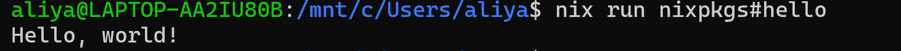
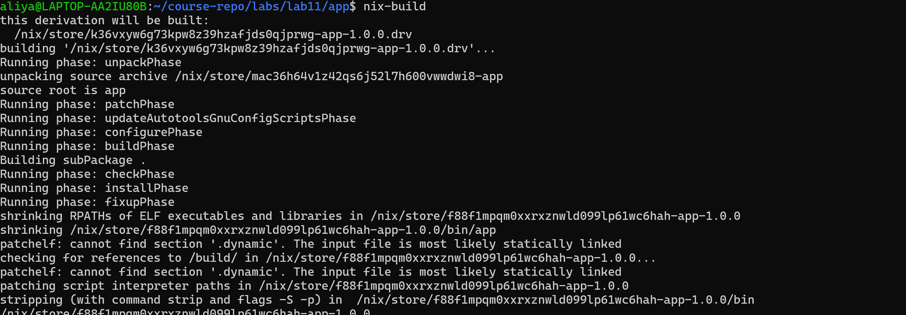

# Task 1
````Вывод программы
./result/bin/app
Built with Nix at compile time
Running at: 2026-04-06T21:56:32+03:00
````

````
readlink result
/nix/store/f88f1mpqm0xxrxznwld099lp61wc6hah-app-1.0.0
````

````
 rm result
aliya@LAPTOP-AA2IU80B:~/course-repo/labs/lab11/app$ nix-build
/nix/store/f88f1mpqm0xxrxznwld099lp61wc6hah-app-1.0.0
aliya@LAPTOP-AA2IU80B:~/course-repo/labs/lab11/app$
aliya@LAPTOP-AA2IU80B:~/course-repo/labs/lab11/app$ readlink result
/nix/store/f88f1mpqm0xxrxznwld099lp61wc6hah-app-1.0.0
````
После удаления и пересборки путь тот же 

````SHA256 бинарника
sha256sum ./result/bin/app
4e287aa1b6891aec26956990866f9818e6f833d178cf5bfeb26d1d916591dfe0  ./result/bin/app
````

````
 docker build -t test-app .
[+] Building 30.3s (3/3) FINISHED       docker:default
 => [internal] load build definition from Docker  0.0s
 => => transferring dockerfile: 110B              0.0s
 => ERROR [internal] load metadata for docker.i  30.2s
 => [auth] library/golang:pull token for registr  0.0s
------
 > [internal] load metadata for docker.io/library/golang:1.22:
------
Dockerfile:1
--------------------
   1 | >>> FROM golang:1.22
   2 |     WORKDIR /app
   3 |     COPY main.go .
--------------------
ERROR: failed to build: failed to solve: DeadlineExceeded: failed to fetch oauth token: Post "https://auth.docker.io/token": dial tcp 172.64.144.78:443: i/o timeout
````  
интернета не хватило

*Анализ*

Почему Docker не воспроизводим (даже без успешной сборки)
Использование тега golang:1.22 – со временем он указывает на разные образы.

В традиционном Dockerfile нет фиксации версий пакетов (например, apt-get install может подтянуть новые версии).

Каждый слой содержит временные метки создания (CREATED), которые различаются при каждой сборке.

Отсутствие песочницы – сборка зависит от хост-системы (версия ядра, переменные окружения)

Что делает Nix воспроизводимым
Content-addressed store – путь зависит от хеша всех входных данных (исходники, зависимости, скрипт сборки).

Sandbox – изоляция от сети и файловой системы (если не разрешено явно).

Фиксированные версии – nixpkgs pinning (через fetchTarball с конкретной ревизией или flake.lock).

Детерминированные сборки – Nix убирает временные метки, использует SOURCE_DATE_EPOCH.

# Task 2

````
{ pkgs ? import (fetchTarball "https://github.com/NixOS/nixpkgs/archive/nixos-24.11.tar.gz") {} }:

let
  app = pkgs.buildGoModule {
    pname = "app";
    version = "1.0.0";
    src = ./.;
    vendorHash = "sha256-f76818c89c4676b344c7913486f3fe2d5013e210e7ba7c95dca4da73769a0340";
  };
in
pkgs.dockerTools.buildLayeredImage {
  name = "nix-app";
  tag = "latest";
  contents = [ app ];
  config.Cmd = [ "${app}/bin/app" ];
}
````

````
docker load < result
Loaded image: nix-app:latest
aliya@LAPTOP-AA2IU80B:~/course-repo/labs/lab11/app$ docker run --rm nix-app:latest
Built with Nix at compile time
Running at: 2026-04-06T19:35:59Z
````

````
 docker history nix-app:latest
IMAGE          CREATED   CREATED BY   SIZE      COMMENT
6a4ef553d898   N/A                    12.3kB    store paths: ['/nix/store/vwb2yjg1pg0whzwk810wjbj5j0xxa39l-nix-app-customisation-layer']
<missing>      N/A                    1.81MB    store paths: ['/nix/store/b3x2ic2rzl7a8ip7v1r662n53ynr3117-app-1.0.0']
<missing>      N/A                    5.33MB    store paths: ['/nix/store/h15ranlgwagilr6ajd7ich6d896kf9zd-tzdata-2026a']
````


````
# Первая сборка
sha256sum result
f76818c89c4676b344c7913486f3fe2d5013e210e7ba7c95dca4da73769a0340  result

# Вторая сборка (после rm result)
sha256sum result
f76818c89c4676b344c7913486f3fe2d5013e210e7ba7c95dca4da73769a0340  result
````
cовпадают

````
rm result
nix-build docker.nix
sha256sum result
these 8 derivations will be built:
  /nix/store/rsckbrss2ch29rmbdgqvyj4k2v073a9z-app-1.0.0.drv
  /nix/store/dyfd4dwma77p0vsw5q8b00kk3j51dka7-nix-app-base.json.drv
  /nix/store/zky0qfbksj821sy6kwjhnikkyay72b0w-nix-app-customisation-layer.drv
  /nix/store/pghh7clbg8v8qj47xgj7wjdkgna731l3-excludePaths.drv
  /nix/store/lr1r8qkd7mqj3jwlg3j239xf0pf7hl22-layers.json.drv
  /nix/store/251l8yi4r3dd6ij64lxbr8zacz2b2m8w-nix-app-conf.json.drv
  /nix/store/3wg7xwpn9lap9mbfipw53xzs6wiivkfr-stream-nix-app.drv
  /nix/store/kv5ip37wjkxrdz1iq1v88478d44gjqf1-nix-app.tar.gz.drv
building '/nix/store/rsckbrss2ch29rmbdgqvyj4k2v073a9z-app-1.0.0.drv'...
Running phase: unpackPhase
unpacking source archive /nix/store/0w6xncfffqyjkkagxcb6kcsmdzqvdpd3-app
source root is app
Running phase: patchPhase
Running phase: updateAutotoolsGnuConfigScriptsPhase
Running phase: configurePhase
Running phase: buildPhase
Building subPackage .
Running phase: checkPhase
Running phase: installPhase
Running phase: fixupPhase
shrinking RPATHs of ELF executables and libraries in /nix/store/c7jqhwmdxkbii0676fp4p4kjc4nrm2qb-app-1.0.0
shrinking /nix/store/c7jqhwmdxkbii0676fp4p4kjc4nrm2qb-app-1.0.0/bin/app
patchelf: cannot find section '.dynamic'. The input file is most likely statically linked
checking for references to /build/ in /nix/store/c7jqhwmdxkbii0676fp4p4kjc4nrm2qb-app-1.0.0...
patchelf: cannot find section '.dynamic'. The input file is most likely statically linked
patching script interpreter paths in /nix/store/c7jqhwmdxkbii0676fp4p4kjc4nrm2qb-app-1.0.0
stripping (with command strip and flags -S -p) in  /nix/store/c7jqhwmdxkbii0676fp4p4kjc4nrm2qb-app-1.0.0/bin
building '/nix/store/dyfd4dwma77p0vsw5q8b00kk3j51dka7-nix-app-base.json.drv'...
building '/nix/store/zky0qfbksj821sy6kwjhnikkyay72b0w-nix-app-customisation-layer.drv'...
building '/nix/store/pghh7clbg8v8qj47xgj7wjdkgna731l3-excludePaths.drv'...
building '/nix/store/lr1r8qkd7mqj3jwlg3j239xf0pf7hl22-layers.json.drv'...
structuredAttrs is enabled
building '/nix/store/251l8yi4r3dd6ij64lxbr8zacz2b2m8w-nix-app-conf.json.drv'...
{
  "architecture": "amd64",
  "config": {
    "Cmd": [
      "/nix/store/c7jqhwmdxkbii0676fp4p4kjc4nrm2qb-app-1.0.0/bin/app"
    ]
  },
  "os": "linux",
  "store_dir": "/nix/store",
  "from_image": null,
  "store_layers": [
    [
      "/nix/store/h15ranlgwagilr6ajd7ich6d896kf9zd-tzdata-2026a"
    ],
    [
      "/nix/store/c7jqhwmdxkbii0676fp4p4kjc4nrm2qb-app-1.0.0"
    ]
  ],
  "customisation_layer": "/nix/store/c670q0vf32jjkmkk99hmmc59dfi94gl2-nix-app-customisation-layer",
  "repo_tag": "nix-app:latest",
  "created": "1970-01-01T00:00:01+00:00",
  "mtime": "1970-01-01T00:00:01+00:00",
  "uid": "0",
  "gid": "0",
  "uname": "root",
  "gname": "root"
}
building '/nix/store/3wg7xwpn9lap9mbfipw53xzs6wiivkfr-stream-nix-app.drv'...
building '/nix/store/kv5ip37wjkxrdz1iq1v88478d44gjqf1-nix-app.tar.gz.drv'...
No 'fromImage' provided
Creating layer 1 from paths: ['/nix/store/h15ranlgwagilr6ajd7ich6d896kf9zd-tzdata-2026a']
Creating layer 2 from paths: ['/nix/store/c7jqhwmdxkbii0676fp4p4kjc4nrm2qb-app-1.0.0']
Creating layer 3 with customisation...
Adding manifests...
Done.
/nix/store/jnz4r3vz5gz3ay94d3a434ap9s3p0631-nix-app.tar.gz
e6bc429dc8c4202341e90afd8cb6a86b25a98f4bb59cb92f5ca0d38734e897d5  result
````

````
 docker run --rm nix-app:latest
Built with Nix at compile time
Running at: 2026-04-06T19:55:25Z
````

Анализ: почему Nix-образы меньше и воспроизводимее
Меньше: Nix помещает в образ только явно указанные contents (бинарник + tzdata), без компиляторов, оболочки, утилит. Статическая компиляция Go даёт самодостаточный бинарник.

Воспроизводимее: каждый слой идентифицируется по хешу содержимого store path. Временная метка фиксирована (created: "1970-01-01"). Нет доступа к сети во время сборки (sandbox). Зависимости привязаны к конкретным ревизиям nixpkgs

Nix: слои = store paths (например, tzdata и app). Порядок слоёв определяется зависимостями. При изменении только app пересобирается только один слой.

Традиционный Docker: каждый RUN, COPY создаёт слой с временной меткой. Даже неизменный Dockerfile даёт разные слои при пересборке.


Практические преимущества content-addressable Docker-образов
Кэширование по хешу – можно безопасно использовать образы в CI/CD, зная, что nix-app:latest всегда один и тот же.

Безопасность – точно известно, какие файлы попали в образ (все из /nix/store).

Экономия места – образы можно дедуплицировать на уровне store.

Воспроизводимость – можно пересобрать образ через год и получить тот же самый tarball.

