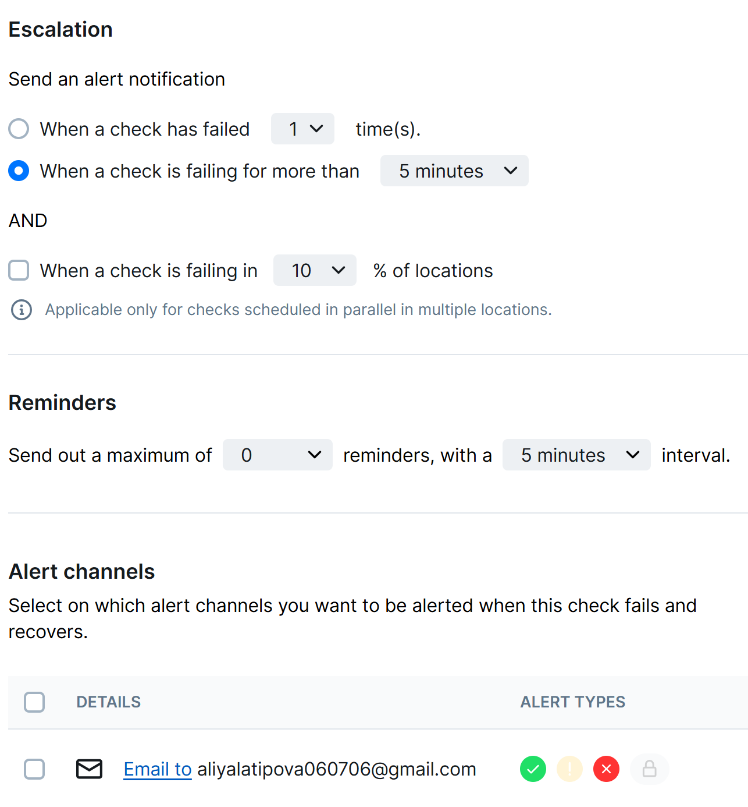

````
 htop
iostat -x 1 5
Linux 6.6.87.2-microsoft-standard-WSL2 (LAPTOP-AA2IU80B)        03/26/26        _x86_64_        (18 CPU)


avg-cpu:  %user   %nice %system %iowait  %steal   %idle
           0.03    0.00    0.05    0.01    0.00   99.92

Device            r/s     rkB/s   rrqm/s  %rrqm r_await rareq-sz     w/s     wkB/s   wrqm/s  %wrqm w_await wareq-sz     d/s     dkB/s   drqm/s  %drqm d_await dareq-sz     f/s f_await  aqu-sz  %util
sda              0.39     24.73     0.15  27.81    0.35    63.74    0.00      0.00     0.00   0.00    0.00     0.00    0.00      0.00     0.00   0.00    0.00     0.00    0.00    0.00    0.00   0.01
sdb              0.05      2.68     0.02  30.30    0.50    51.93    0.00      0.00     0.00   0.00    0.00     0.00    0.00      0.00     0.00   0.00    0.00     0.00    0.00    0.00    0.00   0.00
sdc              0.03      0.71     0.00   0.00    0.74    22.73    0.00      0.00     0.00   0.00    2.00     2.00    0.00      0.00     0.00   0.00    0.00     0.00    0.00    3.00    0.00   0.00
sdd              3.85    164.43     0.83  17.79    0.35    42.70    1.03     35.71     1.49  59.10    4.48    34.56    0.05    104.00     0.00   6.17    0.26  2137.45    0.25    0.77    0.01   0.17


avg-cpu:  %user   %nice %system %iowait  %steal   %idle
           0.00    0.00    0.06    0.00    0.00   99.94

Device            r/s     rkB/s   rrqm/s  %rrqm r_await rareq-sz     w/s     wkB/s   wrqm/s  %wrqm w_await wareq-sz     d/s     dkB/s   drqm/s  %drqm d_await dareq-sz     f/s f_await  aqu-sz  %util
sda              0.00      0.00     0.00   0.00    0.00     0.00    0.00      0.00     0.00   0.00    0.00     0.00    0.00      0.00     0.00   0.00    0.00     0.00    0.00    0.00    0.00   0.00
sdb              0.00      0.00     0.00   0.00    0.00     0.00    0.00      0.00     0.00   0.00    0.00     0.00    0.00      0.00     0.00   0.00    0.00     0.00    0.00    0.00    0.00   0.00
sdc              0.00      0.00     0.00   0.00    0.00     0.00    0.00      0.00     0.00   0.00    0.00     0.00    0.00      0.00     0.00   0.00    0.00     0.00    0.00    0.00    0.00   0.00
sdd              0.00      0.00     0.00   0.00    0.00     0.00    0.00      0.00     0.00   0.00    0.00     0.00    0.00      0.00     0.00   0.00    0.00     0.00    0.00    0.00    0.00   0.00


avg-cpu:  %user   %nice %system %iowait  %steal   %idle
           0.06    0.00    0.00    0.00    0.00   99.94

Device            r/s     rkB/s   rrqm/s  %rrqm r_await rareq-sz     w/s     wkB/s   wrqm/s  %wrqm w_await wareq-sz     d/s     dkB/s   drqm/s  %drqm d_await dareq-sz     f/s f_await  aqu-sz  %util
sda              0.00      0.00     0.00   0.00    0.00     0.00    0.00      0.00     0.00   0.00    0.00     0.00    0.00      0.00     0.00   0.00    0.00     0.00    0.00    0.00    0.00   0.00
sdb              0.00      0.00     0.00   0.00    0.00     0.00    0.00      0.00     0.00   0.00    0.00     0.00    0.00      0.00     0.00   0.00    0.00     0.00    0.00    0.00    0.00   0.00
sdc              0.00      0.00     0.00   0.00    0.00     0.00    0.00      0.00     0.00   0.00    0.00     0.00    0.00      0.00     0.00   0.00    0.00     0.00    0.00    0.00    0.00   0.00
sdd              0.00      0.00     0.00   0.00    0.00     0.00    0.00      0.00     0.00   0.00    0.00     0.00    0.00      0.00     0.00   0.00    0.00     0.00    0.00    0.00    0.00   0.00


avg-cpu:  %user   %nice %system %iowait  %steal   %idle
           0.00    0.00    0.00    0.00    0.00  100.00

Device            r/s     rkB/s   rrqm/s  %rrqm r_await rareq-sz     w/s     wkB/s   wrqm/s  %wrqm w_await wareq-sz     d/s     dkB/s   drqm/s  %drqm d_await dareq-sz     f/s f_await  aqu-sz  %util
sda              0.00      0.00     0.00   0.00    0.00     0.00    0.00      0.00     0.00   0.00    0.00     0.00    0.00      0.00     0.00   0.00    0.00     0.00    0.00    0.00    0.00   0.00
sdb              0.00      0.00     0.00   0.00    0.00     0.00    0.00      0.00     0.00   0.00    0.00     0.00    0.00      0.00     0.00   0.00    0.00     0.00    0.00    0.00    0.00   0.00
sdc              0.00      0.00     0.00   0.00    0.00     0.00    0.00      0.00     0.00   0.00    0.00     0.00    0.00      0.00     0.00   0.00    0.00     0.00    0.00    0.00    0.00   0.00
sdd              0.00      0.00     0.00   0.00    0.00     0.00    0.00      0.00     0.00   0.00    0.00     0.00    0.00      0.00     0.00   0.00    0.00     0.00    0.00    0.00    0.00   0.00


avg-cpu:  %user   %nice %system %iowait  %steal   %idle
           0.00    0.00    0.06    0.00    0.00   99.94

Device            r/s     rkB/s   rrqm/s  %rrqm r_await rareq-sz     w/s     wkB/s   wrqm/s  %wrqm w_await wareq-sz     d/s     dkB/s   drqm/s  %drqm d_await dareq-sz     f/s f_await  aqu-sz  %util
sda              0.00      0.00     0.00   0.00    0.00     0.00    0.00      0.00     0.00   0.00    0.00     0.00    0.00      0.00     0.00   0.00    0.00     0.00    0.00    0.00    0.00   0.00
sdb              0.00      0.00     0.00   0.00    0.00     0.00    0.00      0.00     0.00   0.00    0.00     0.00    0.00      0.00     0.00   0.00    0.00     0.00    0.00    0.00    0.00   0.00
sdc              0.00      0.00     0.00   0.00    0.00     0.00    0.00      0.00     0.00   0.00    0.00     0.00    0.00      0.00     0.00   0.00    0.00     0.00    0.00    0.00    0.00   0.00
sdd              0.00      0.00     0.00   0.00    0.00     0.00    0.00      0.00     0.00   0.00    0.00     0.00    0.00      0.00     0.00   0.00    0.00     0.00    0.00    0.00    0.00   0.00
````

````
df -h
du -h /var | sort -rh | head -n 10
Filesystem      Size  Used Avail Use% Mounted on
none            3.8G     0  3.8G   0% /usr/lib/modules/6.6.87.2-microsoft-standard-WSL2
none            3.8G  4.0K  3.8G   1% /mnt/wsl
drivers         200G  187G   14G  94% /usr/lib/wsl/drivers
/dev/sdd       1007G  2.6G  954G   1% /
none            3.8G   96K  3.8G   1% /mnt/wslg
none            3.8G     0  3.8G   0% /usr/lib/wsl/lib
rootfs          3.8G  2.7M  3.8G   1% /init
none            3.8G  592K  3.8G   1% /run
none            3.8G     0  3.8G   0% /run/lock
none            3.8G     0  3.8G   0% /run/shm
none            3.8G   76K  3.8G   1% /mnt/wslg/versions.txt
none            3.8G   76K  3.8G   1% /mnt/wslg/doc
C:\             200G  187G   14G  94% /mnt/c
D:\             255G   20G  236G   8% /mnt/d
tmpfs           770M   20K  770M   1% /run/user/1000
du: cannot read directory '/var/lib/ubuntu-advantage/apt-esm/var/lib/apt/lists/partial': Permission denied
du: cannot read directory '/var/lib/private': Permission denied
du: cannot read directory '/var/lib/docker': Permission denied
du: cannot read directory '/var/lib/snapd/cookie': Permission denied
du: cannot read directory '/var/lib/snapd/void': Permission denied
du: cannot read directory '/var/lib/polkit-1': Permission denied
du: cannot read directory '/var/lib/apt/lists/partial': Permission denied
du: cannot read directory '/var/lib/containerd': Permission denied
du: cannot read directory '/var/spool/rsyslog': Permission denied
du: cannot read directory '/var/spool/cron/crontabs': Permission denied
du: cannot read directory '/var/tmp/systemd-private-5055c5d5492d4409b6b25e5b7239a779-systemd-timesyncd.service-DfsFT2': Permission denied     
du: cannot read directory '/var/tmp/systemd-private-5055c5d5492d4409b6b25e5b7239a779-polkit.service-n6rPOl': Permission denied
du: cannot read directory '/var/tmp/systemd-private-5055c5d5492d4409b6b25e5b7239a779-systemd-resolved.service-cHjJJA': Permission denied      
du: cannot read directory '/var/tmp/systemd-private-5055c5d5492d4409b6b25e5b7239a779-systemd-logind.service-y6rcJn': Permission denied        
du: cannot read directory '/var/cache/private': Permission denied
du: cannot read directory '/var/cache/ldconfig': Permission denied
du: cannot read directory '/var/cache/apt/archives/partial': Permission denied
du: cannot read directory '/var/log/private': Permission denied
796M    /var
392M    /var/log
390M    /var/log/journal/03b3c34a93014a5bb0eff75cdfbc6f1a
390M    /var/log/journal
259M    /var/lib
229M    /var/lib/apt/lists
229M    /var/lib/apt
145M    /var/cache
128M    /var/cache/apt
20M     /var/lib/dpkg
````

````Поиск трёх самых больших файлов в /var
 sudo find /var -type f -exec du -h {} + | sort -rh | head -n 3
[sudo] password for aliya: 
70M     /var/lib/apt/lists/archive.ubuntu.com_ubuntu_dists_noble_universe_binary-amd64_Packages
59M     /var/cache/apt/srcpkgcache.bin
59M     /var/cache/apt/pkgcache.bin
````

````
ps aux --sort=-%cpu | head -n 4
USER         PID %CPU %MEM    VSZ   RSS TTY      STAT START   TIME COMMAND
root         226  0.2  0.5 2311384 44412 ?       Ssl  14:58   0:07 /usr/bin/containerd
root           1  0.0  0.1  22124 12364 ?        Ss   14:58   0:02 /sbin/init
root         296  0.0  1.0 2727824 84080 ?       Ssl  14:58   0:01 /usr/bin/dockerd -H fd:// --containerd=/run/containerd/containerd.sock     
````

````
 ps aux --sort=-%mem | head -n 4
USER         PID %CPU %MEM    VSZ   RSS TTY      STAT START   TIME COMMAND
root         296  0.0  1.0 2727824 84080 ?       Ssl  14:58   0:01 /usr/bin/dockerd -H fd:// --containerd=/run/containerd/containerd.sock     
root         226  0.2  0.5 2311384 44412 ?       Ssl  14:58   0:07 /usr/bin/containerd
root         247  0.0  0.2 107028 22176 ?        Ssl  14:58   0:00 /usr/bin/python3 /usr/share/unattended-upgrades/unattended-upgrade-shutdown
````
PU и память: система практически не нагружена. Наибольшую долю CPU (0.2%) потребляет процесс containerd, что ожидаемо для фоновой работы Docker. Память также используется незначительно – максимальное потребление у dockerd (1.0% от общего объёма).

I/O: активность дисков крайне низкая (r/s, w/s почти нулевые, utilisation < 1%). Это указывает на отсутствие интенсивного ввода-вывода.

Дисковое пространство: корневая файловая система (/dev/sdd) занята всего на 1%, однако смонтированный диск Windows (/mnt/c) заполнен на 94%. Внутри /var основное пространство занимают логи (/var/log – 392 МБ) и кэш APT (/var/cache/apt – 128 МБ). Три самых больших файла относятся к кэшам пакетного менеджера (APT).

Паттерны: система работает в режиме простоя, основные потребляемые ресурсы – дисковое пространство, причём наибольший объём приходится на временные файлы и логи. Это типично для свежеустановленной или малоактивной системы под управлением WSL.

### Task 2
````
/**
  * To learn more about Playwright Test visit:
  * https://checklyhq.com/docs/browser-checks/playwright-test/
  * https://playwright.dev/docs/writing-tests
  */

const { expect, test } = require('@playwright/test')

// Configure the Playwright Test timeout to 210 seconds,
// ensuring that longer tests conclude before Checkly's browser check timeout of 240 seconds.
// The default Playwright Test timeout is set at 30 seconds.
// For additional information on timeouts, visit: https://checklyhq.com/docs/browser-checks/timeouts/
test.setTimeout(210000)

// Set the action timeout to 10 seconds to quickly identify failing actions.
// By default Playwright Test has no timeout for actions (e.g. clicking an element).
test.use({ actionTimeout: 10000 })

test('visit page and take screenshot', async ({ page }) => {
  // Change checklyhq.com to your site's URL,
  // or, even better, define a ENVIRONMENT_URL environment variable
  // to reuse it across your browser checks
  const response = await page.goto(process.env.ENVIRONMENT_URL || 'https://wikipedia.com')

  // Take a screenshot
  await page.screenshot({ path: 'screenshot.jpg' })

  // Test that the response did not fail
  expect(response.status(), 'should respond with correct status code').toBeLessThan(400)
})
````

