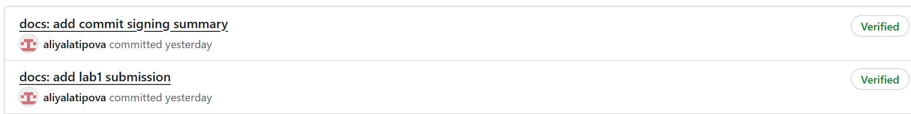

!img_3.png](img_3.png)
**Количество CRITICAL уязвимостей:** 10  
**Количество HIGH уязвимостей:** 49  

**Два примера уязвимых пакетов с CVE:**
1. **crypto-js** – `CVE-2023-46233` (CRITICAL) – проблема в PBKDF2, который в 1000 раз слабее спецификации.
2. **handlebars** – `CVE-2026-33937` (CRITICAL) – удалённое выполнение кода через crafted Abstract Syntax Tree.

**Наиболее частый тип уязвимостей:**  
Отказ в обслуживании (Denial of Service), включая ReDoS, чрезмерную буферизацию и утечки памяти. Второй по частоте – prototype pollution и удалённое выполнение кода (RCE).

Сканирование контейнерных образов перед деплоем критически важно, так как позволяет выявить известные CVE до того, как они попадут в production. Образ Juice Shop содержит 10 критических и 49 высокорисковых уязвимостей в зависимостях (RCE в handlebars, побег из песочницы в vm2, DoS в multer). Злоумышленник мог бы полностью захватить приложение или вызвать отказ в обслуживании. Trivy даёт возможность обновить зависимости или заменить образ до развёртывания.